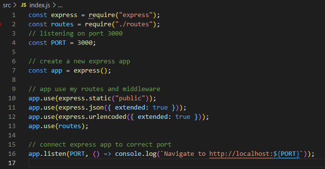

# Note Taker 

Note Taker allows the user to write and save notes. This application uses an Express.js back end, it saves and retrieves note data from a JSON file.


## User Story

```
AS A small business owner
I WANT to be able to write and save notes
SO THAT I can organize my thoughts and keep track of tasks I need to complete
```

## Acceptance Criteria

```
GIVEN a note-taking application
WHEN I open the Note Taker
THEN I am presented with a landing page with a link to a notes page
WHEN I click on the link to the notes page
THEN I am presented with a page with existing notes listed in the left-hand column, plus empty fields to enter a new note title and the note’s text in the right-hand column
WHEN I enter a new note title and the note’s text
THEN a Save icon appears in the navigation at the top of the page
WHEN I click on the Save icon
THEN the new note I have entered is saved and appears in the left-hand column with the other existing notes
WHEN I click on an existing note in the list in the left-hand column
THEN that note appears in the right-hand column
WHEN I click on the Write icon in the navigation at the top of the page
THEN I am presented with empty fields to enter a new note title and the note’s text in the right-hand column
```

## Tools Used:

- Node.js
- Express.js
- Heroku
- JSON

#### Languages:

- JavaScript
- HTML
- CSS

#### Express.js

Express is a minimal and flexible Node.js web application framework that provides a robust set of features, providing a thin layer of fundamental web application features, without obscuring Node.js features.

With a myriad of HTTP utility methods and middleware at your disposal, creating a robust API is quick and easy.

#### End Points

Routing refers to how an application’s endpoints (URIs) respond to client requests.

You define routing using methods of the Express app object that correspond to HTTP methods; for example, `app.get()` to handle `GET` requests and app.post to handle `POST` requests.



A route method is derived from one of the HTTP methods, and is attached to an instance of the express class.

The following code is an example from this app of routes that are defined for the GET, POST AND DELETE methods to the root of the app.

GET method:

```
router.get("/", getNotes);
router.get("/:id", getNoteById);
```

POST method:

```
router.post("/", addNote);
```

DELETE method:

```
router.delete("/:id", deleteNote);
```

These routes each have a function that sits in a file within the controllers folder. Here the functions written in JavaScript however, each function `returns` a `response` that looks like this:

```
return res.json(note);
```

#### Database

A JSON document database is a type of nonrelational database that is designed to store and query data as JSON documents, rather than normalizing data across multiple tables, each with a unique and fixed structure, as in a relational database.

#### How it works

The below is a set of sample code, illustrating the endpoints, and the responses `to` and `from` JSON.

- GET /notes
  This will return an array of notes

An example for this response looks like this:

```json
[
  {
    "id": "9bb20464-c339-4b74-8139-d07547d8fe8a",
    "title": "Get milk",
    "text": "Blue top"
  }
]
```

- POST /notes
  This will create a new note

POST body:

```json
{
  "title": "yur title",
  "text": "your text"
}
```

- DELETE /notes/:id
  Will delete a note by ID

### References

[ExpressJS](https://expressjs.com/)

[Screencastify](https://www.screencastify.com/)

[Mozilla.org](https://developer.mozilla.org/en-US/docs/)

[StackOverflow](https://stackoverflow.com/questions/)

## License


This project is licensed under the terms of the MIT license.

## Questions

If you:

- have any questions about this project
- would like further information
- would like to report and issue

please contact me through the links below:

[GitHub](https://github.com/fudge88) Profile

Email: akhlaq.fahra@gmail.com
